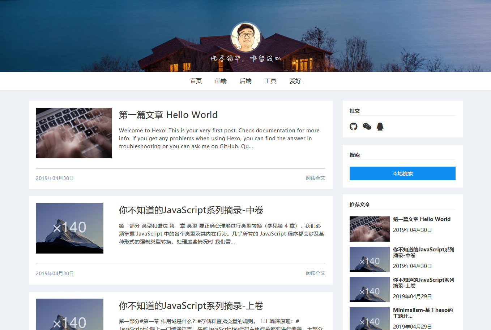

# 个人博客

使用hexo创建的个人博客，目前正在开发主题。准备以后用来展示自己不错的笔记。

更新时间： 2019-4-30

# hexo 主题开发记录

想要开发一个hexo主题的主要原因就是希望主题这方面的设计能尽量的满足个人的想法。

# 搭建主题开发的环境

安装 `hexo-cli`

```bash
npm install hexo-cli -g
```

通常一个 hexo 主题的文件目录是是固定的，我们使用 `generator-hexo-theme` 这个脚手架生成基本的主题目录

```bash
npm install -g yo
npm install -g generator-hexo-theme
```

接下来我们使用使用 hexo-cli 初始化一个 hexo 博客，并进入`themes` 目录，我们可以看到生成的项目中自带了一个`landscape`主题

```bash
hexo init blog-site
cd blog-site/themes
```

接下来创建要开发的 `theme` 目录，并使用脚手架创建文件结构

```bash
mkdir minimalism
cd minimalism/
yo hexo-theme

tree

.
├── _config.yml # 主题配置文件
├── layout # 布局文件
│   ├── archive.ejs # 归档页面
│   ├── category.ejs # 分类页面
│   ├── index.ejs # 主页
│   ├── layout.ejs # 页面布局
│   ├── page.ejs # 详情页面
│   ├── partials 
│   │   └── recent-posts.ejs # 文章列表模板
│   ├── post.ejs # 文章页面
│   └── tag.ejs # 标签页面
├── package.json
├── scripts
│   └── readme.md
└── source # 资源文件夹
    ├── css
    │   └── minimalism.scss
    ├── favicon.ico # 站点图标
    └── js
        └── minimalism.js
```

在项目跑起来之前，我们还需要将blog的主题设置成我们刚才创建主题，找到 `themes/_config.yml`，将 `theme: lanscape` 更换成 `theme: paper`，之后我们通过 `hexo s` 启动 hexo blog，通过浏览器访问我们可以看到一个包含一篇"hello world"的文章并且没有任何`css`的 blog 首页。

为了方便主题的开发，我们安装`hexo-browsersync`，在开发模式下，对应文件的修改，将会使得页面重新刷新。

```shell
npm install hexo-browsersync --save-dev
```

# 页面开发

首先了解的是`layout`这个文件夹的文件，`layout.ejs`放着整个网站布局的核心代码。

```ejs
<%- body %>
```

`layout.ejs` 文件中这个标记是渲染页面的内容, 也即是说切换页面都是渲染这一块。

下边是主页和文章详情页面的布局，分别对应`layout`目录下`inde.ejs`和`post.ejs`文件

**首页**


**文章详情页**


目前的一个页面一个大体的布局自上而下是头部，导航，主体（分为主要部分和侧边栏部分），底部。个人和博客没必要搞的特别的花哨，简单就好，第一版就更不用说了，能展现大体的内容即可。

### 补充遇到的一些问题：

在开发中发现markdown文章过长会导致渲染不全，并且不渲染其他的部分的HTML比如文章侧边栏的目录部分，后来发现是之前我在前文为了方便开发引入了`hexo-browsersync`这个包导致的问题，已经删除这个包。我们在开发的时候尽量提供hexo本身提供的API和一些帮助函数，它提供的插件貌似和hexo本身会有一些问题，比如`hexo-toc`这个插件，hexo现在已经提供了`toc`的帮助函数，没必要用这个插件，网上有的开发者称这个包在`hexo@3x`版本中使用会有问题。

